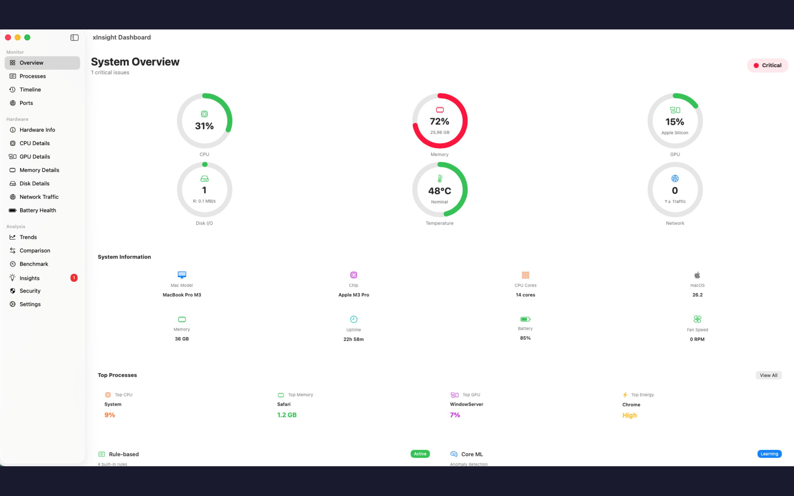
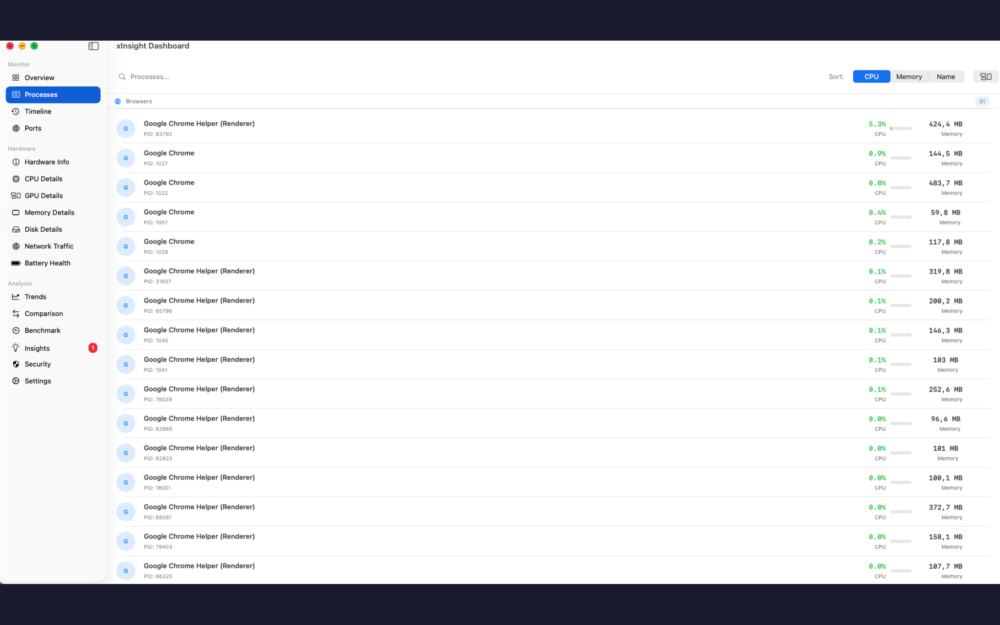
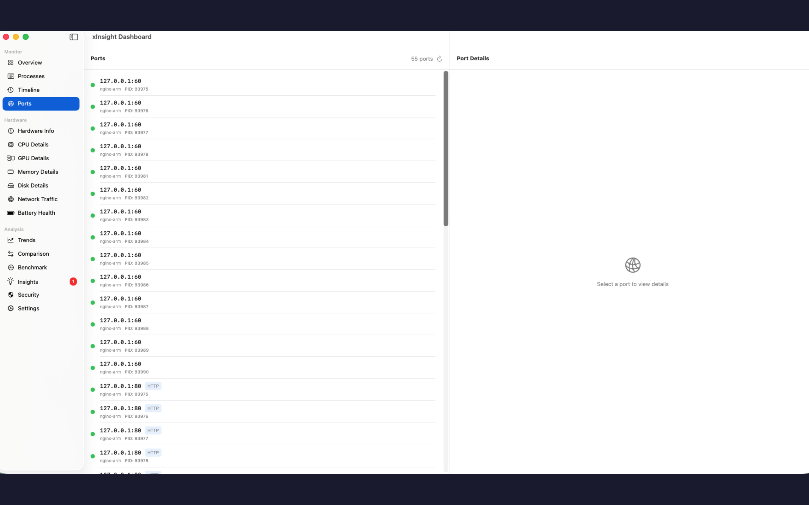
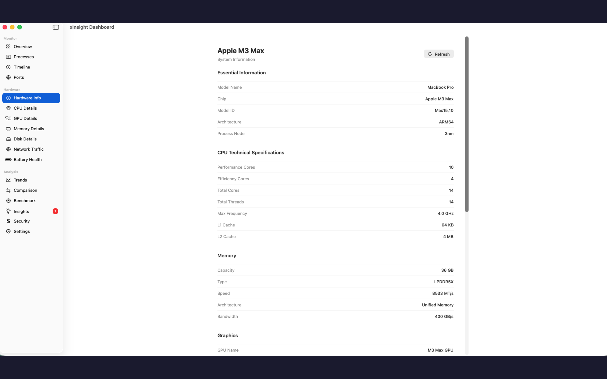
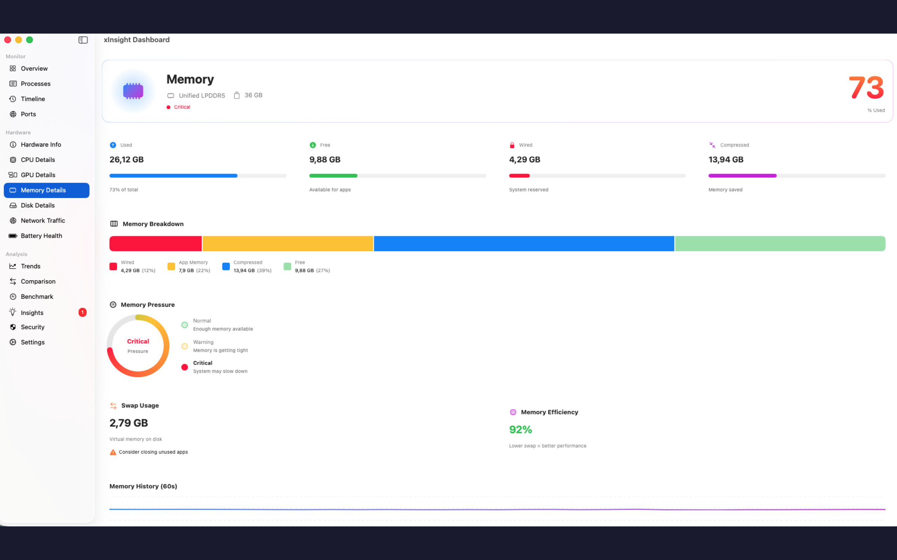

<div align="center">
  <br><br>
  
  <h1>🖥️ xInsight Lite</h1>
  <p><strong>Free System Monitor for macOS</strong></p>
  <p>A lightweight, free system monitoring tool for your Mac.</p>
  
  [](https://github.com/tdduydev/xInsight-lite)
  [](LICENSE)
  [](https://swift.org)
  [](https://github.com/tdduydev/xInsight-lite)
  
  [](https://apps.apple.com/app/xinsight-lite/id6740610582)
</div>

---

## 📸 Screenshots

<p align="center">
  
  
  
  
  
</p>

---

## ✨ Features

### 💻 Hardware Information
- **Hardware Info Tab** — CPU-Z style detailed hardware specifications
- **CPU Details** — Name, architecture, P/E cores, threads, frequency, cache
- **Memory Specs** — Total RAM, type (LPDDR5), speed, bandwidth
- **GPU Information** — GPU name, cores, Metal version, process node
- **Neural Engine** — Core count, TOPS performance

### 🖥️ Desktop & Menu Bar Widgets
- **Menu Bar Widgets** — Quick stats always visible:
  - 💻 CPU usage
  - 🎮 GPU usage
  - 🧮 RAM usage
  - 💾 Disk usage
  - 🌐 Network speed
  - 🔋 Battery level
  - 🔌 Active ports
  - 🧹 Cleanup status

### 📊 System Monitoring
- **Overview Dashboard** — Interactive gauges with click-to-navigate
- **CPU Detail** — Per-core usage (P-cores & E-cores), temperature, history charts
- **GPU Detail** — Real-time GPU usage %, memory usage
- **Memory Detail** — Used/wired/compressed breakdown
- **Network & Disk I/O** — Download/Upload speeds, disk read/write
- **🔋 Battery Health** — Cycle count, health %, temperature

### 🛠️ Powerful Tools
- **🧹 Disk Cleanup** — Clean cache files, logs, and temporary data
- **📀 Disk Analysis** — Pie chart breakdown, large file detection
- **🗑️ App Uninstaller** — Complete uninstall with related files
- **🚀 Startup Manager** — View and manage LaunchAgents
- **📋 Process Monitor** — Real-time process list
- **🔌 Ports Monitor** — Network ports with kill action

### 🛡️ Security & Privacy
- **Security Scanner** — Check SIP, Gatekeeper, FileVault, Firewall
- **Security Score** — Overall rating (0-100) with recommendations

### 🌍 Multi-language Support
- English, Vietnamese, Chinese, Japanese, Korean, Spanish, French, German

## 📋 Requirements

- macOS 14.0 (Sonoma) or later
- Apple Silicon (M1/M2/M3/M4) or Intel Mac

## 🚀 Installation

### Build from Source

```bash
git clone https://github.com/tdduydev/xInsight-lite.git
cd xInsight-lite
swift build
swift run xInsight-lite
```

### Using Xcode

```bash
# Install XcodeGen if needed
brew install xcodegen

# Generate Xcode project
xcodegen generate

# Open in Xcode
open xInsight-lite.xcodeproj
```

## 📄 License

MIT License — Free for personal and commercial use.

---

<div align="center">
  <sub>Built with ❤️ by <a href="https://xdev.asia">xDev.asia</a></sub>
</div>
